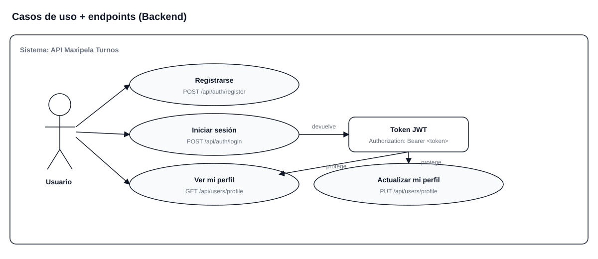
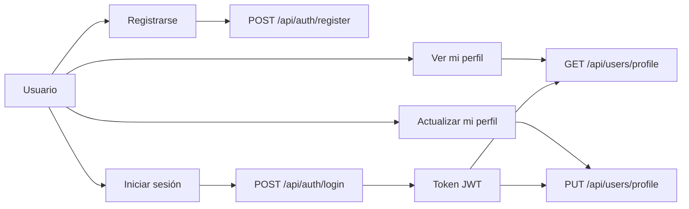
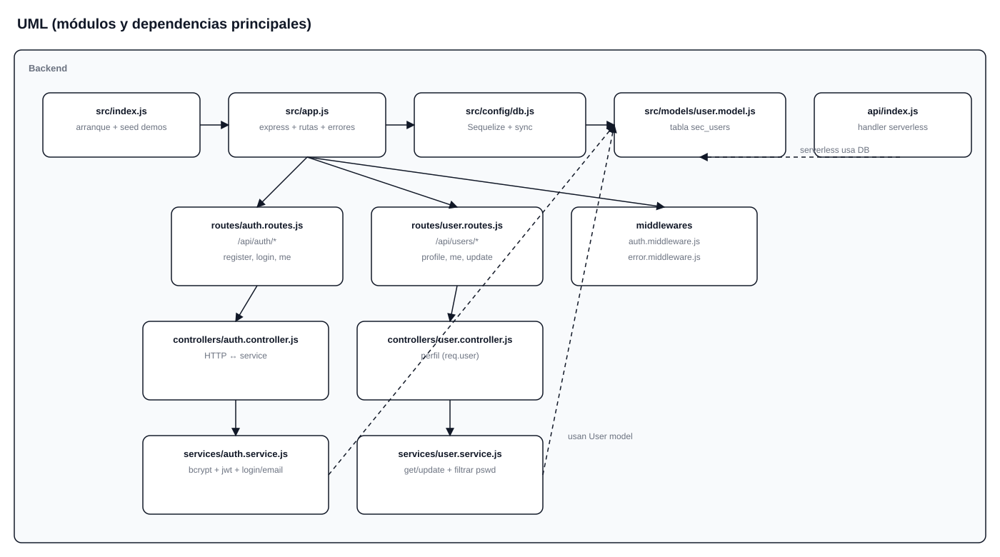
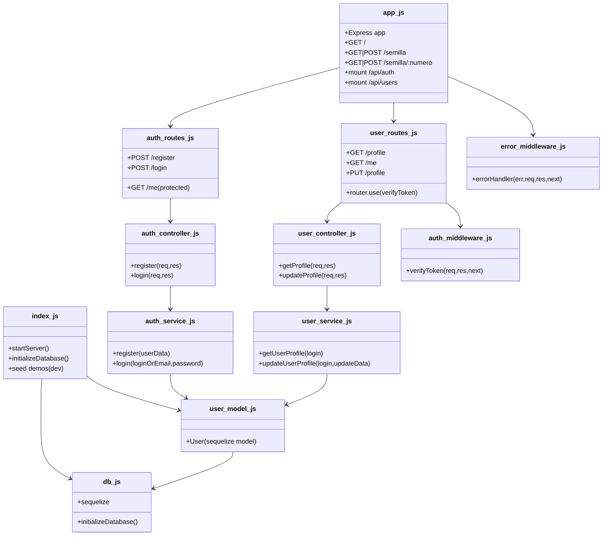
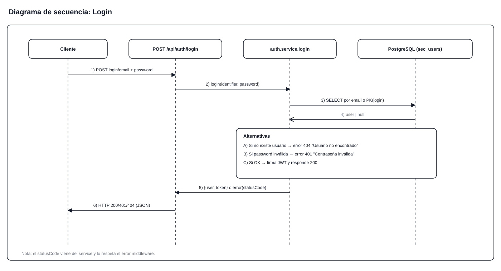
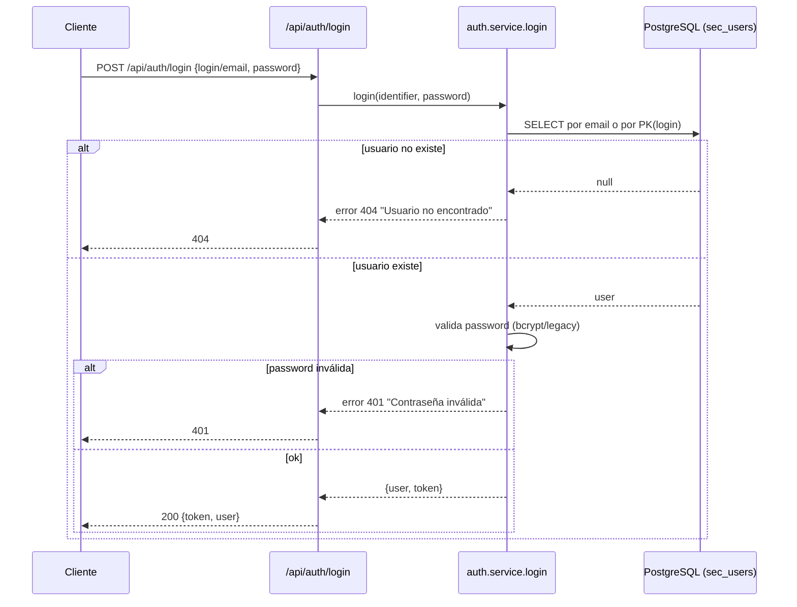

# Documentación Backend (MAXIGABY)

## 1) URL base y rutas

- Local (dev): `http://localhost:3000` (o el `PORT` configurado)
- Prefijo API: `/api`
- Healthcheck: `GET /` devuelve estado y timestamp

### Auth

- `POST /api/auth/register`
- `POST /api/auth/login`
- `GET /api/auth/me` (requiere `Authorization: Bearer <token>`)

### Usuarios

- `GET /api/users/profile` (requiere token)
- `GET /api/users/me` (alias de profile, requiere token)
- `PUT /api/users/profile` (requiere token)

### Semilla (solo desarrollo)

- `GET /semilla` / `POST /semilla` crea 1 usuario demo
- `GET /semilla/:numero` / `POST /semilla/:numero` crea N usuarios (máximo 20)
- `GET /semilla/:number` / `POST /semilla/:number` alias de `:numero`

Usuarios demo creados:

- `demo` -> `demo@demo.com`
- `demo1` -> `demo1@demo.com`
- `demo2` -> `demo2@demo.com`
- ...

Password demo: `123456`

## 2) Diagramas

### 2.1 Casos de uso (diagrama)





### 2.2 UML (módulos principales)





### 2.3 Diagrama de secuencia (login)





## 3) Cómo trabaja cada archivo (con fragmentos)

### [app.js](file:///c:/Users/game/Desktop/MAXIGABY/backend/src/app.js)

Responsabilidades:

- Crea el servidor Express.
- Configura middlewares globales (`cors`, `morgan`, `json`, `urlencoded`).
- Define healthcheck `GET /`.
- Monta rutas `auth` y `users`.
- Define rutas de semilla (solo desarrollo).
- Registra el manejador de errores y 404.

Fragmentos clave:

```js
app.use('/api/auth', authRoutes)
app.use('/api/users', userRoutes)
app.use(errorHandler)
```

La semilla:

```js
app.post('/semilla/:numero', handleSemilla)
app.get('/semilla/:numero', handleSemilla)
```

### [index.js](file:///c:/Users/game/Desktop/MAXIGABY/backend/src/index.js)

Responsabilidades:

- Inicializa la base de datos con `initializeDatabase()`.
- En desarrollo, crea demos al arrancar.
- Inicia el server en `PORT`.

Seed al boot:

```js
await initializeDatabase()
await User.bulkCreate(usersToCreate, { ignoreDuplicates: true })
```

### [api/index.js](file:///c:/Users/game/Desktop/MAXIGABY/backend/api/index.js) (Vercel serverless)

Responsabilidades:

- Re-exporta el handler serverless para Vercel.
- Inicializa DB una vez (cache en memoria) y reusa conexión.

```js
let dbInitialized = false
const initDB = async () => { ... }
export default async function handler(req, res) { return app(req, res) }
```

### [config/db.js](file:///c:/Users/game/Desktop/MAXIGABY/backend/src/config/db.js)

Responsabilidades:

- Carga `.env.local` y `.env`.
- Construye Sequelize usando `DATABASE_URL` o `POSTGRES_URL`.
- Configura SSL/pool según ambiente.
- Sincroniza modelos en `initializeDatabase()`.

Variables usadas:

```js
const DATABASE_URL = process.env.DATABASE_URL || process.env.POSTGRES_URL
```

En desarrollo, reseteo opcional al boot:

```js
const shouldResetOnBoot = !isProduction && process.env.PRESERVE_DB !== 'true'
const syncOptions = isProduction ? { alter: false } : (shouldResetOnBoot ? { force: true } : { alter: true })
```

### [routes/auth.routes.js](file:///c:/Users/game/Desktop/MAXIGABY/backend/src/routes/auth.routes.js)

Responsabilidades:

- Define endpoints de autenticación.

```js
router.post('/register', authController.register)
router.post('/login', authController.login)
router.get('/me', verifyToken, (req, res) => res.json({ user: req.user }))
```

### [routes/user.routes.js](file:///c:/Users/game/Desktop/MAXIGABY/backend/src/routes/user.routes.js)

Responsabilidades:

- Protege todas las rutas con JWT.
- Expone endpoints de perfil.

```js
router.use(verifyToken)
router.get('/profile', userController.getProfile)
router.put('/profile', userController.updateProfile)
```

### [controllers/auth.controller.js](file:///c:/Users/game/Desktop/MAXIGABY/backend/src/controllers/auth.controller.js)

Responsabilidades:

- Orquesta request/response y delega al service.
- Acepta `login` o `email` en el body para login.

```js
const login = req.body.login || req.body.email
const password = req.body.password || req.body.pswd
const result = await authService.login(login, password)
```

### [controllers/user.controller.js](file:///c:/Users/game/Desktop/MAXIGABY/backend/src/controllers/user.controller.js)

Responsabilidades:

- Usa `req.user.login` (viene del token) para obtener/actualizar perfil.

```js
const user = await userService.getUserProfile(req.user.login)
```

### [services/auth.service.js](file:///c:/Users/game/Desktop/MAXIGABY/backend/src/services/auth.service.js)

Responsabilidades:

- `register()` crea usuario con bcrypt.
- `login()` busca por email si el identificador contiene `@`, si no por login (PK).
- Migra contraseñas legacy (MD5/texto plano) a bcrypt.
- Firma JWT.

Buscar usuario por email o login:

```js
const user = identifier.includes('@')
  ? await User.findOne({ where: { email: identifier } })
  : await User.findByPk(identifier)
```

Errores con statusCode:

```js
const err = new Error('Usuario no encontrado')
err.statusCode = 404
throw err
```

### [services/user.service.js](file:///c:/Users/game/Desktop/MAXIGABY/backend/src/services/user.service.js)

Responsabilidades:

- `getUserProfile()` obtiene el usuario y filtra `pswd`.
- `updateUserProfile()` actualiza campos permitidos y devuelve sin `pswd`.

```js
const { pswd, ...userWithoutPassword } = user.toJSON()
```

### [middlewares/auth.middleware.js](file:///c:/Users/game/Desktop/MAXIGABY/backend/src/middlewares/auth.middleware.js)

Responsabilidades:

- Lee `Authorization: Bearer <token>` y valida el JWT.
- Setea `req.user` con el payload.

```js
const token = req.header('Authorization')?.replace('Bearer ', '')
const verified = jwt.verify(token, JWT_SECRET)
req.user = verified
```

### [middlewares/error.middleware.js](file:///c:/Users/game/Desktop/MAXIGABY/backend/src/middlewares/error.middleware.js)

Responsabilidades:

- Traduce errores de Sequelize.
- Respeta `err.statusCode` para errores de negocio.

```js
const statusCode = err.statusCode || err.status || 500
res.status(statusCode).json({ message: err.message })
```

### [models/user.model.js](file:///c:/Users/game/Desktop/MAXIGABY/backend/src/models/user.model.js)

Responsabilidades:

- Define la tabla `sec_users` y sus campos.
- Define `login` como primary key.
- Hook `beforeUpdate` para setear `f_update`.

```js
const User = sequelize.define('sec_users', { ... }, { tableName: 'sec_users', timestamps: false })
```

## 4) Variables de entorno y “base” para deploy

### 4.1 Variables requeridas

- `DATABASE_URL` o `POSTGRES_URL`: conexión a PostgreSQL
- `JWT_SECRET` o `TOKEN_SECRET`: firma de tokens
- `NODE_ENV`: `production` o `development`
- `PORT`: solo para local/Render (Vercel ignora el puerto)

Variables opcionales (dev):

- `PRESERVE_DB=true` evita reset (si no, resetea al boot)
- `SEED_DEMOS=5..20` cantidad de usuarios demo al iniciar en desarrollo

### 4.2 Dónde poner la “URL base”

En backend, la “URL base” es el dominio donde queda desplegado:

- Local: `http://localhost:3000`
- Render: `https://<tu-servicio>.onrender.com`
- Vercel: `https://<tu-proyecto>.vercel.app`

El backend no necesita una variable `BASE_URL` para funcionar; lo que sí necesita es la DB y el secret. La URL base se usa normalmente en el frontend (por ejemplo `API_BASE_URL`) para apuntar al backend.

Si querés forzar un valor en backend (por ejemplo para generar links), usá una variable `BASE_URL` y leéla con `process.env.BASE_URL` donde corresponda.

## 5) Deploy en Render y Vercel (qué configurar)

### 5.1 Render

Config ya declarada en [render.yaml](file:///c:/Users/game/Desktop/MAXIGABY/backend/render.yaml):

- `NODE_ENV=production`
- `JWT_SECRET` (autogenerado)
- `DATABASE_URL` (viene de la DB creada por Render)

### 5.2 Vercel

Config serverless en [vercel.json](file:///c:/Users/game/Desktop/MAXIGABY/backend/vercel.json):

- `api/index.js` es el entrypoint serverless
- Todo el tráfico se redirige a `/api/index.js`

Variables a setear en Vercel (Dashboard → Settings → Environment Variables):

- `NODE_ENV=production`
- `JWT_SECRET` (o `TOKEN_SECRET`)
- `POSTGRES_URL` (si usás Vercel Postgres) o `DATABASE_URL`

Además, Vercel Postgres suele inyectar `POSTGRES_URL` automáticamente cuando conectás la DB al proyecto.

